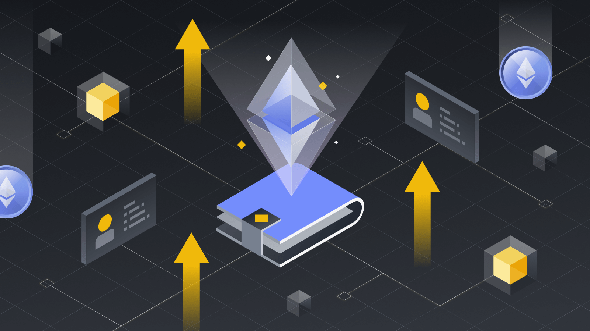

<div align="center">
  <a href="https://particle.network/">
    
  </a>
  <h3>
    Particle Bundler RPC Server
  </h3>
</div>


Particle Bundler RPC completes compatible with [ERC4337 standards](https://eips.ethereum.org/EIPS/eip-4337). It is extremely stable and supports high concurrency requests.

## ⚡️ Live
👉 We have deployed a server on production: https://docs.particle.network/developers/node-service/evm-chains-api/bundler-rpc

👉 Try the demo: https://scroll-testnet.particle.network/

## 🔬 Functionalities
</img>

- All standard RPCs supported
- All can be configured: RPCs, Signers, etc
- Support any chain
- UserOp Persistence
- UserOp Concurrent Handling
- Built-in gas price oracle
- Multi Bundler Signers Manager
- Auto Retry for failed transaction
- Correct Transaction even when affected by MEV
- Deploy new chains with one line code

## 📖 Related articles 
[ERC-4337: Predicting the Gas Consumption of UserOperation](https://blog.particle.network/bundler-predicting-gas/)

## 🔧 Quick Start

### 💿 Clone the project
```bash
git https://github.com/Particle-Network/particle-bundler-server.git
cd particle-bundler-server
yarn
```

### 🧷 Setup the environment
Set your configuration in **.env**. We require the **mysql**
You need to transfer some native token to the Bundler Signer.
Register the particle project at [https://dashboard.particle.network/](https://dashboard.particle.network/).

### 🏄🏻‍♂️ Start the project
```bash
npm run start
```

### 🖖 Start a gasless transaction
create a new terminal and run the test
```bash
npx jest rpc.controller.spec -t 'Gasless Basic' --chainId=${the chain you want to test}
```

### 🧷 Custom the bundler config
Set your configuration in **/src/configs/bundler-config.ts**.

* CHAIN_SIGNER_MIN_BALANCE: the minimum balance of the signer, if the signer's balance is less than this value, the payment signer will automatically transfer the token to the signer.
* CHAIN_VERIFYING_PAYMASTER_MIN_DEPOSIT: the minimum deposit of the paymaster, if the paymaster's deposit is less than this value, the payment signer will automatically transfer the token to the paymaster.

### 📝 Scripts
deploy AA & Simple Account for a new chain
```bash
// set a signer in scripts/deploy-aa.ts

npx ts-node scripts/deploy-aa.ts 11155111
```


## 🛀🏽 API doc

Learn more on [https://docs.particle.network/developers/node-service/evm-chains-api/bundler-rpc](https://docs.particle.network/developers/node-service/evm-chains-api/bundler-rpc)

## 💼 Feedback

If you got some problems, please report bugs or issues.

You can also join our [Discord](https://discord.gg/2y44qr6CR2).